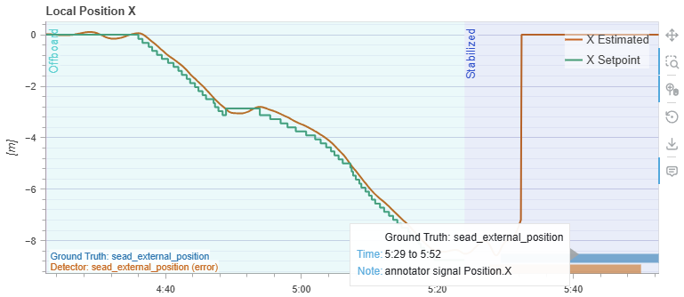
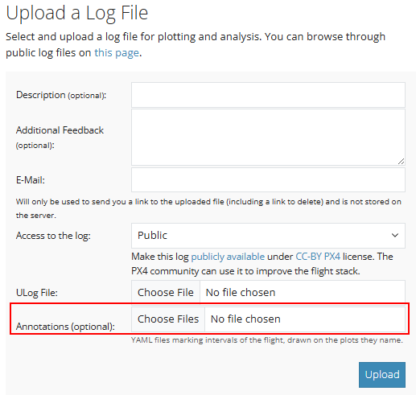

# PX4 Flight Review - UAV-SEAD annotations

A fork of [PX4 Flight Review](https://github.com/PX4/flight_review) (fork point `26c8707`) that can
draw **annotations** on the plots: intervals somebody knows something about - ground truth from a
test sheet, the verdict of an external analyzer - uploaded as YAML alongside the log, listed in a
table above the plots and shaded onto the plot each one names.

It exists as the viewer for an unsupervised anomaly-detection experiment on the UAV-SEAD dataset: 1,396 real-world PX4 flight logs over 52.4 hours.



*The annotators' ground truth in blue against the detector's finding in orange, on the same time
axis. The two were arrived at independently.*

---

## The approach

- **Input** - unlabelled flights with an *assumed* anomaly prevalence. No anomaly label enters the
  fit; every threshold comes from the statistics of the population itself.
- **Tuning** - where a threshold goes is chosen the way an operator would choose it, from domain
  knowledge of what each fault looks like, checked against labelled examples. The held-out numbers
  below are a read that was pre-registered and refit nothing.
- General methodology:
  - **Interval splitting** - each flight is cut into *legs* by flight phase and turbulence, so a leg
    is measured against its own population.
  - **Feature selection** - per class and leg type, which channel to read and which statistic to
    read it with.
  - **Two bands** - so an operator can triage: `error` is tuned for precision and can be acted on,
    `warn` for recall and is flagged for review. The flight takes the worst band any finding reached.

## Results

Held-out split, 361 logs attempted / 351 scored. `warn+` counts a flight the detector said anything
about, so it is a superset of `error`.

### Flight-level

Did the detector fire on the right flight?

| tier | accuracy | precision | recall | J |
|---|---:|---:|---:|---:|
| `error` | 70% | 57% | 75% | 0.424 |
| `warn+` | 54% | 44% | 92% | 0.237 |

The bands do what they were tuned for: precision rises 44% -> 57% going to `error`, recall falls
92% -> 75%. Flight-level AUPRC is **0.709**, estimated using a 4-point trapezoid.

Per class, one-vs-rest over the flights that assessed each class:

| class | flights | error precision | error recall | warn+ precision | warn+ recall | AUPRC |
|---|---:|---:|---:|---:|---:|---:|
| `sead_external_position` | 57 | 44% | 89% | 31% | 96% | 0.679 |
| `sead_mechanical` | 14 | 11% | 64% | 7% | 100% | 0.389 |
| `sead_global_position` | 12 | 38% | 42% | 14% | 50% | 0.355 |
| `sead_altitude` | 21 | 21% | 38% | 19% | 62% | 0.326 |

### Event-level

Did it fire in the right place? Each event is an annotated interval, matched by overlap with what the
detector shaded.

| tier | precision | recall | background | shade |
|---|---:|---:|---:|---:|
| `error` | 44% | 72% | 18.2% | 48% |
| `warn+` | 30% | 89% | 40.3% | 68% |

The same trade as above: precision rises 30% -> 44% going to `error`, recall falls 89% -> 72%.
Event-level AUPRC is **0.616** against 0.709 at flight level, and the gap between them is how much of
the result is localization rather than flight-level discrimination alone.

A recall figure here cannot be read without a null, since a detector that shades everything hits
every event. Two are given. **background** is the share of *confirmed-clean* flight time shaded -
is it quiet when nothing is wrong? **shade** is the share of the offending flight's own span - was
the hit aimed, or did it just cover most of that flight? Recall clears the first by 54 points at
`error` and the second, which is the conservative one, by 24. Both are differences of rates, so
neither moves with prevalence.

| class | events | error precision | error recall | warn+ precision | warn+ recall | AUPRC |
|---|---:|---:|---:|---:|---:|---:|
| `sead_external_position` | 62 | 34% | 85% | 23% | 92% | 0.607 |
| `sead_mechanical` | 26 | 11% | 65% | 7% | 100% | 0.396 |
| `sead_global_position` | 20 | 38% | 30% | 13% | 35% | 0.274 |
| `sead_altitude` | 38 | 17% | 39% | 15% | 61% | 0.306 |

There is no accuracy or J column here, at either level of detail: an interval label asserts that
something happened and cannot assert that nothing did, so there is no true-negative cell to compute
specificity from - the two nulls above stand in for it. For the same reason precision and recall here
do not form a confusion matrix - overlap is many-to-many, so the two are different numerators over
different denominators.

### Against benchmark

[**AeroTSBoost**](https://arxiv.org/abs/2605.25639) (Wei et al., 2026) is the published benchmark on
UAV-SEAD: a supervised, class-balanced LightGBM over window descriptors. Its unit is a 9.6 s window
on a 0.8 s stride, so the rows below re-score this detector on that grid, under the leave-log-out
protocol its comparable figure uses.

| method | labels in fit | AUPRC | event F1 |
|---|---|---:|---:|
| AeroTSBoost | supervised | 0.6388 ± 0.0315 | 0.5342 |
| 9 unlabelled baselines | none | 0.1826 - 0.2411 | - |
| **this detector** | none | **0.447** | **0.614** |

Window unit, π₀ = 7.18%, held-out logs, for all three.

**The AUPRC is a bracket.** Their 0.6388 is a swept average precision; two thresholds on one ranking
only *bound* what a sweep would earn - 0.447 down to roughly 0.19, the width being the 49.4% of
windows that censor into one tie block. The favourable end is 70% of a supervised model with no label
in the fit; the pessimistic end falls back inside the unlabelled band. Neither is the same object as
their AP (Davis & Goadrich, on PR interpolation). The shortfall is real either way - the favourable
end alone is ~6.8 SD of their spread.

**The event F1 lead is indicative, not like-for-like:** event matching is this detector's own
definition and theirs is not fully specified. It is at least not vacuous - the trivial baseline at
π₀ = 7.18% is 0.134.

The flight-level 0.709 and event-level 0.616 above do not belong in this column: AUPRC's chance floor
*is* the prevalence.

### In practice

An operator opens a log, not a nine-second window. As triage, the `error` band flags 171 of the 351
held-out flights and catches 98 of the 130 that were bad; reviewing 171 at random would find 63, so
it is **55% more faults per log reviewed**. `warn+` trades that efficiency for coverage - 92% of the
faults for 77% of the flights - which is the setting for when a miss is expensive. Within a flagged
flight the shading narrows where to look, though only to about half of it.

Flight and event level are the unit this is built for; the window row above exists to answer a
window-level paper on its own terms.

## Annotations

The feature is independent of the experiment: any YAML in this format draws on any log.

```yaml
version: 1
sources:
  - name: Ground Truth
    color: "#0072b2"
    annotations:
      - category: takeoff_wobble
        graph: Roll Angle     # the plot's title, or 'Nav-...' fragment id
        intervals:
          - start: "01:23"
            end: "01:40"
            annotation: "oscillation"       # optional
          - start: "02:10"
            value: "roll rate 12.4 deg/s"   # optional
```

Times are read the way the x-axis is labelled - seconds since boot, not since the log began - so an
annotation time is whatever you read off the plot. A log uploaded without annotations renders
exactly as it does upstream.



*The one addition to the upload page: an optional **Annotations** field taking any number of YAML
files alongside the `.ulg`.*

## Running it

### Docker

A slim multi-stage image built from this repository: `yuhongherald/px4-flight-review`, 624 MB against
1.23 GB for the single-stage build it replaces.

```bash
# The submodule is not optional: an uninitialized plot_app/libevents fails the build.
git submodule update --init --recursive

VER=$(date +%Y%m%d)
docker build -t yuhongherald/px4-flight-review:$VER app

docker login
docker push yuhongherald/px4-flight-review:$VER

docker compose pull
docker compose up -d     # start on http://localhost:5006
```

Pin `:$VER` in [`docker-compose.yml`](docker-compose.yml) - that line is what `docker compose pull`
resolves. `DOMAIN` in [`.env`](.env) must match the host:port the browser uses, or Bokeh refuses the
websocket and no plots load.

### Examples

Two annotated logs ship in [`app/examples/`](app/examples/). Upload one `.ulg` with **both** of its
YAML files selected in the *Annotations* field:

```
app/examples/logs/2019-01-08__09_05_30.ulg
app/examples/annotations/2019-01-08__09_05_30.ground-truth.yaml
app/examples/annotations/2019-01-08__09_05_30.detector.yaml
```

The page then carries both sources side by side - ground truth in blue, detector findings in orange
at `error` and amber at `warn`. `09_05_30` is the flight in the screenshot at the top;
`07_46_23` is the other, a `sead_mechanical` case. Both logs are from UAV-SEAD and carry its CC BY
4.0 licence - see [Resources](#resources) for the attribution.

## Resources

- **Dataset** - [UAV-SEAD](https://huggingface.co/datasets/aykutkabaoglu/uav-flight-anomaly-dataset),
  *State Estimation Anomaly Dataset for UAVs*, Kabaoglu & Sariel (2026), CC BY 4.0
  ([10.57967/hf/7772](https://doi.org/10.57967/hf/7772)). Its four fault classes are
  `sead_mechanical`, `sead_external_position`, `sead_global_position` and `sead_altitude`.
- **Published baseline** - [AeroTSBoost](https://arxiv.org/abs/2605.25639), Wei et al. (2026),
  arXiv:2605.25639. Source of the reference values in [Results](#against-benchmark).
- **Upstream** - [PX4/flight_review](https://github.com/PX4/flight_review).

## Upstream

Everything not described here is upstream's and unchanged.
